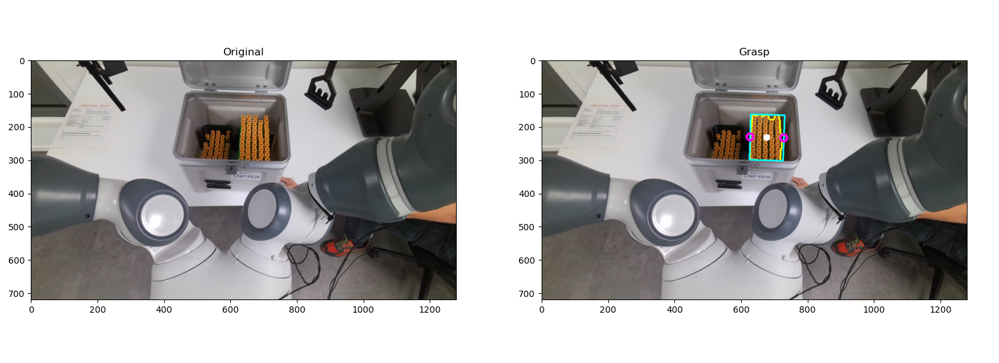

# Harmony_InBoxGrasping_ROS2

# Dependencies
The code requires `python>=3.10`, as well as `pytorch>=2.0.1` and 'CUDA Version: 12.0'

Install pytorch:
```
pip install torch torchvision 
```

Install Segment Anything:
```
pip install git+https://github.com/facebookresearch/segment-anything.git
```


The following optional dependencies are necessary for mask post-processing, 

```
pip install opencv-python pycocotools numpy matplotlib onnxruntime onnx 
```

Install open3d:
```
pip install open3d
```


Click the links below to download the checkpoint for the corresponding model type.

- **`default` or `vit_h`: [ViT-H SAM model.](https://dl.fbaipublicfiles.com/segment_anything/sam_vit_h_4b8939.pth)**
- `vit_l`: [ViT-L SAM model.](https://dl.fbaipublicfiles.com/segment_anything/sam_vit_l_0b3195.pth)
- `vit_b`: [ViT-B SAM model.](https://dl.fbaipublicfiles.com/segment_anything/sam_vit_b_01ec64.pth)


After downloading, put the models into `models/` folder which is next to the src folder. By defualt we used `vit_b` model, but it can be replace by the others.


# Compile and Running
To compile the code, use the following commands inside the directory:
```
cd Harmony_InBoxGrasping_ROS2
colcon build
```
When colcon has completed building successfully, the output will be in the install directory. Before you can use any of the installed executables or libraries, you will need to add them to your path and library paths using the following command:
```
source install/local_setup.bash 
``` 

and then run the service using the following command:
```
ros2 run rack_detection service
```

Then, open another terminal, go to the directory (`Harmony_InBoxGrasping_ROS2`) and again source the install directory:
```
cd Harmony_InBoxGrasping_ROS2
source install/local_setup.bash 
```
after sourcing, run the client node using the following command:
```
ros2 run rack_detection client 0 0 0
```
In case everything is working, you will see an image similar to the following:



Note that the three zeros in the client side (`0 0 0`) are a set of parameters used for debuging purpose. 
